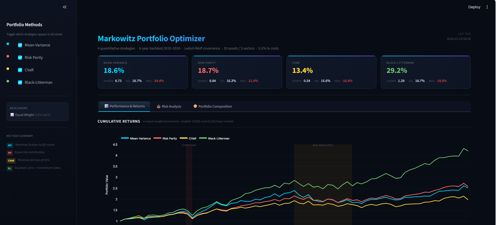

# Markowitz Portfolio Optimizer

<p align="center">
  
</p>

<p align="center">
  <a href="https://github.com/Ares-Infenus/markowitz-portfolio-optimizer/actions/workflows/ci.yml">
    
  </a>
  <a href="https://codecov.io/gh/Ares-Infenus/markowitz-portfolio-optimizer">
    
  </a>
  
  
  
  
  
</p>

> A production-grade portfolio optimization system implementing four quantitative strategies,
> backtested over six years of real market data, with an interactive dark-theme dashboard.

---

## Table of Contents

1. [Results & Business Insights](#-results--business-insights)
2. [Methodology](#️-methodology)
3. [Architecture](#️-architecture)
4. [Repository Structure](#-repository-structure)
5. [Quickstart](#-quickstart)
6. [Configuration](#-configuration)
7. [Testing](#-testing)
8. [Design Decisions](#-design-decisions)
9. [License](#-license)

---

## 📊 Results & Business Insights

> **Who this section is for:** investors, portfolio managers, and decision-makers who want to understand what the system found — without reading the code.

### The Core Question

*If you had invested $1 in a diversified US equity portfolio in January 2019, how much would four different scientific allocation strategies have returned by December 2024 — and at what risk?*

---

### What We Found

Over **six years** (2019–2024) covering the COVID crash, the 2022 bear market, and the 2023–2024 bull run, the four strategies produced significantly different outcomes:

| Strategy | Total Return | Annual Return | Worst Drawdown | Risk-Adj. (Sharpe) |
|---|---|---|---|---|
| **Black-Litterman** | **+320%** | **+29.2%** | -18.8% | **1.29** |
| Risk Parity | +158% | +18.7% | -21.0% | 0.84 |
| Mean-Variance | +151% | +18.6% | -24.4% | 0.73 |
| CVaR | +98% | +13.4% | **-18.4%** | 0.54 |
| *Equal Weight (benchmark)* | *+115%* | *+20.6%* | *-21.8%* | *0.91* |

> Sharpe Ratio above 1.0 means the strategy earned more than 1 unit of return per unit of risk taken, after subtracting a 5% risk-free rate.

---

### Three Takeaways

**1. Being smart about views pays off — a lot.**
Black-Litterman, which adjusts allocations based on which assets have been building momentum over the past six months, turned $1 into **$4.20** — more than double the equal-weight benchmark. It did this while keeping its worst-ever loss to just 18.8%, less than the benchmark's 21.8%.

**2. Low volatility does not mean low return.**
Risk Parity, designed to spread *risk* equally rather than money equally, achieved nearly the same return as Mean-Variance (+18.7% vs +18.6% annually) but with **13% less volatility**. It also showed the lowest average monthly turnover (0.8%) — meaning fewer trades and lower costs.

**3. Playing it safe has a price.**
CVaR minimises tail losses — the "disaster scenarios." It succeeded: its worst month was smaller than any other strategy. But that caution translated to the lowest total return (+98%) over the period. It's the right tool for capital-preservation mandates, not growth portfolios.

---

### When Would You Use Each Strategy?

| If your priority is… | Use this strategy |
|---|---|
| Maximum long-term growth | Black-Litterman |
| Smooth ride with good returns | Risk Parity |
| Diversification across risk sources | Mean-Variance |
| Capital preservation / low tail risk | CVaR |
| Zero-effort baseline | Equal Weight |

---

### What This System Enables

- **Compare strategies side-by-side** on the same assets, period, and cost assumptions — apples to apples.
- **Explore trade-offs interactively** via the dashboard: toggle strategies, navigate rebalance dates, inspect exact allocations.
- **Swap the universe** — change the 10 tickers in `.env` and re-run; the entire pipeline adapts automatically.
- **Extend with new strategies** — the plug-in architecture means adding a 5th method is a single new file.

---

## ⚙️ Methodology

### Asset Universe

10 US equities across 5 sectors, selected for liquidity, sector diversity, and data availability:

| Ticker | Company | Sector |
|---|---|---|
| AAPL | Apple | Technology |
| MSFT | Microsoft | Technology |
| JPM | JPMorgan Chase | Financials |
| GS | Goldman Sachs | Financials |
| JNJ | Johnson & Johnson | Healthcare |
| UNH | UnitedHealth Group | Healthcare |
| XOM | ExxonMobil | Energy |
| NEE | NextEra Energy | Utilities |
| AMZN | Amazon | Consumer Discretionary |
| PG | Procter & Gamble | Consumer Staples |

**Data source:** Yahoo Finance via `yfinance` — adjusted close prices, 2019-01-02 to 2024-12-30 (1,509 trading days).

---

### Portfolio Constraints (applied to all methods)

```
max_weight     = 0.20   # No single asset > 20%
min_weight     = 0.02   # No single asset < 2%
sector_limit   = 0.40   # No sector > 40% combined
max_leverage   = 1.0    # Long-only; weights sum to exactly 1.0
transaction_cost = 0.001 # 0.1% on actual turnover each rebalance
```

---

### Optimization Methods

#### A — Mean-Variance (Markowitz, 1952)
**Solver:** cvxpy — Quadratic Program (CLARABEL)

```
Maximize:   μᵀw − λ · wᵀΣw
Subject to: Σwᵢ = 1,  wᵢ ∈ [min_weight, max_weight]
```

`μ` = annualised expected returns · `Σ` = Ledoit-Wolf covariance · `λ = 1.0` (risk aversion)

The efficient frontier is generated by sweeping `λ` from 0.1 to 10.0 across 100 points.

---

#### B — Risk Parity
**Solver:** scipy — SLSQP (non-convex, cannot use cvxpy)

```
Minimize:   Σᵢ Σⱼ (RCᵢ − RCⱼ)²
where:      RCᵢ = wᵢ · (Σw)ᵢ / wᵀΣw   (risk contribution of asset i)
Subject to: Σwᵢ = 1,  wᵢ ∈ [min_weight, max_weight]
```

Initialised at equal weights. Tolerance `ftol=1e-12`, max 1,000 iterations.

---

#### C — CVaR Optimization (Rockafellar & Uryasev, 2000)
**Solver:** cvxpy — Linear Program (CLARABEL)

```
Minimize:   ζ + 1/(1−α) · (1/T) · Σᵢ uᵢ
Subject to: uᵢ ≥ −rᵢᵀw − ζ,  uᵢ ≥ 0  ∀i
            Σwⱼ = 1,  wⱼ ∈ [min_weight, max_weight]
```

`α = 0.95` — minimises expected loss in the worst 5% of historical scenarios. Uses all T historical return vectors directly (no distributional assumption).

---

#### D — Black-Litterman
**Library:** PyPortfolioOpt

```
Posterior: E[R] = [(τΣ)⁻¹ + PᵀΩ⁻¹P]⁻¹ · [(τΣ)⁻¹Π + PᵀΩ⁻¹Q]
Π = δΣw_mkt   (CAPM reverse-optimisation, δ=2.5, τ=0.05)
```

**Views are data-driven, not subjective:**
- Top 3 assets by 6-month trailing momentum → bullish view: +2% above equilibrium
- Bottom 3 assets by 6-month trailing momentum → bearish view: −1% below equilibrium
- Views updated at each monthly rebalance

Final weights from max-Sharpe on the posterior return vector.

---

### Covariance Estimation

All methods use **Ledoit-Wolf analytical shrinkage** (scikit-learn) rather than the sample covariance matrix:

```python
from sklearn.covariance import LedoitWolf
lw = LedoitWolf().fit(returns_window)
cov_annualised = lw.covariance_ * 252
```

With T≈1,500 and N=10 the sample covariance is already well-conditioned, but Ledoit-Wolf eliminates extreme eigenvalues and is standard practice in production quant systems.

---

### Backtest Design

| Parameter | Value |
|---|---|
| Period | 2019-01-02 → 2024-12-30 |
| Rebalance frequency | Monthly (first business day) |
| Window type | **Expanding** — uses all data up to each rebalance date |
| Transaction cost | 0.1% × actual turnover = `cost = (Σ\|wₜ − wₜ₋₁\| / 2) × 0.001` |
| First allocation | No transaction cost |
| Benchmark | Equal weight (10% each, monthly rebalance) |
| Initial portfolio value | 1.0 (normalised) |

**Why expanding window?** A rolling window (e.g. 252 days) discards old data. An expanding window uses all available history at each step, producing more stable covariance estimates as the backtest progresses — closer to how a live system would operate after years of data accumulation.

---

### Performance Metrics

| Metric | Formula |
|---|---|
| Annualised Return | `(1 + μ_monthly)^12 − 1` |
| Annualised Volatility | `σ_monthly × √12` |
| Sharpe Ratio | `(R_ann − 0.05) / σ_ann` |
| Sortino Ratio | `(R_ann − 0.05) / σ_downside_ann` |
| Max Drawdown | `max((peak − trough) / peak)` |
| CVaR 95% | `mean(returns where return < percentile_5)` |
| Calmar Ratio | `R_ann / |Max Drawdown|` |

---

## 🏗️ Architecture

```
yfinance API
    │
    ▼
DataIngestion ──────────────────────────► prices.parquet
    │
    ▼
ReturnEngine (log-returns) ──────────────► returns.parquet
    │
    ▼
CovarianceEngine (Ledoit-Wolf) ──────────► cov_matrix.parquet
    │
    ├──► MeanVarianceOptimizer  (cvxpy QP)
    ├──► RiskParityOptimizer    (scipy SLSQP)
    ├──► CVaROptimizer          (cvxpy LP)
    └──► BlackLittermanOptimizer (PyPortfolioOpt)
              │
              ▼
         BacktestEngine (monthly, expanding window, tx costs)
              │
              ▼
         PerformanceAnalytics ──────────► performance_summary.parquet
                                         backtest_results.parquet
                                         weights_store.parquet
                                              │
                                              ▼
                                    Streamlit Dashboard
                                    (port 8501, read-only)
```

**Key patterns:**

- **Strategy Pattern** — all optimizers implement `BaseOptimizer.optimize(returns, cov, mu) → pd.Series`. Adding a 5th method = one new file + one line in `run_pipeline.py`.
- **Pipeline idempotency** — each stage checks for its Parquet output before recomputing. Re-running the pipeline skips already-completed stages.
- **Circuit breaker** — a failing optimizer never stops the others; the pipeline logs the error and continues.
- **Zero computation in dashboard** — `app.py` only reads Parquet files. All heavy lifting happens in the pipeline.

---

## 📁 Repository Structure

```
markowitz-portfolio-optimizer/
│
├── .github/workflows/ci.yml       # lint → test → docker build
├── assets/images/                 # screenshots for README
├── docker/
│   ├── Dockerfile.optimizer       # pipeline image (python:3.11-slim)
│   └── Dockerfile.dashboard       # streamlit image (python:3.11-slim)
├── docs/
│   └── architecture.md            # Mermaid diagram + ADRs
├── src/
│   ├── data/
│   │   ├── ingestion.py           # yfinance download + retry + cache
│   │   └── preprocessing.py       # log-returns + Ledoit-Wolf covariance
│   ├── optimizers/
│   │   ├── base.py                # BaseOptimizer ABC (Strategy Pattern)
│   │   ├── mean_variance.py       # Markowitz QP — cvxpy
│   │   ├── risk_parity.py         # Risk Parity — scipy SLSQP
│   │   ├── cvar.py                # CVaR LP — cvxpy (Rockafellar-Uryasev)
│   │   └── black_litterman.py     # Black-Litterman — PyPortfolioOpt
│   ├── backtest/
│   │   ├── engine.py              # monthly rebalance loop + tx costs
│   │   └── metrics.py             # Sharpe, Sortino, MDD, CVaR, Calmar
│   ├── dashboard/
│   │   ├── app.py                 # Streamlit entry point + layout
│   │   └── components/
│   │       ├── backtest_chart.py  # cumulative returns + drawdown
│   │       ├── efficient_frontier.py
│   │       ├── allocation_chart.py
│   │       ├── weights_heatmap.py
│   │       ├── performance_table.py
│   │       └── radar_chart.py     # 5-dimension risk profile
│   ├── pipeline/
│   │   └── run_pipeline.py        # end-to-end orchestrator
│   └── utils/
│       ├── config.py              # typed Settings dataclass from .env
│       └── logger.py              # structured logging + daily rotation
├── tests/
│   ├── conftest.py                # synthetic fixtures (seed=42, 5 assets)
│   ├── test_ingestion.py
│   ├── test_preprocessing.py
│   ├── test_optimizers.py         # weight constraints, solver correctness
│   ├── test_backtest.py
│   └── test_metrics.py
├── .env.example                   # configuration template
├── .gitignore
├── .python-version                # 3.11
├── docker-compose.yml
├── pyproject.toml                 # ruff + black + pytest config
├── requirements.txt
└── requirements-dev.txt
```

---

## 🚀 Quickstart

### Option A — Docker (recommended, zero environment setup)

```bash
git clone https://github.com/Ares-Infenus/markowitz-portfolio-optimizer.git
cd markowitz-portfolio-optimizer

# 1. Configure (defaults work out of the box)
cp .env.example .env

# 2. Run the full pipeline (~5 min first run, downloads 6 years of data)
docker compose up --build optimizer

# 3. Launch the dashboard
docker compose up dashboard
# Open http://localhost:8501
```

The `dashboard` service waits for `optimizer` to complete (`depends_on: service_completed_successfully`) before starting.

---

### Option B — Local Python

**Requirements:** Python 3.11+

```bash
git clone https://github.com/Ares-Infenus/markowitz-portfolio-optimizer.git
cd markowitz-portfolio-optimizer

# Create and activate virtual environment
python -m venv venv
source venv/bin/activate          # Windows: venv\Scripts\activate

# Install dependencies
pip install -r requirements.txt

# Configure
cp .env.example .env

# Run pipeline (downloads data, optimizes, backtests, saves Parquet)
PYTHONPATH=. python src/pipeline/run_pipeline.py

# Launch dashboard
PYTHONPATH=. streamlit run src/dashboard/app.py
# Windows PowerShell:
# $env:PYTHONPATH="."; streamlit run src/dashboard/app.py
```

**Expected pipeline output:**

```
2024-01-15 10:23:45 | INFO | pipeline | [1/4] Data ingestion
2024-01-15 10:23:58 | INFO | pipeline | [2/4] Computing returns and covariance
2024-01-15 10:24:01 | INFO | pipeline | [3/4] Running optimizers and backtests
2024-01-15 10:24:01 | INFO | pipeline | ✓ mean_variance completed in 12.4s
2024-01-15 10:24:13 | INFO | pipeline | ✓ risk_parity completed in 38.7s
2024-01-15 10:24:52 | INFO | pipeline | ✓ cvar completed in 15.1s
2024-01-15 10:25:07 | INFO | pipeline | ✓ black_litterman completed in 9.3s
2024-01-15 10:25:16 | INFO | pipeline | [4/4] Computing performance metrics
2024-01-15 10:25:16 | INFO | pipeline | Pipeline completed in 95.2s
```

---

## ⚙️ Configuration

All parameters live in `.env` (copy from `.env.example`). No code changes needed to swap the universe, dates, or constraints.

```bash
# ── Data ──────────────────────────────────────────────────────────────────────
TICKERS=AAPL,MSFT,JPM,GS,JNJ,UNH,XOM,NEE,AMZN,PG
START_DATE=2019-01-01
END_DATE=2024-12-31

# ── Constraints ────────────────────────────────────────────────────────────────
MAX_WEIGHT=0.20          # max weight per asset
MIN_WEIGHT=0.02          # min weight per asset
SECTOR_LIMIT=0.40        # max combined weight per sector
TRANSACTION_COST=0.001   # 0.1% on actual turnover

# ── Risk ───────────────────────────────────────────────────────────────────────
RISK_FREE_RATE=0.05      # annualised, used in Sharpe/Sortino
CVAR_CONFIDENCE=0.95

# ── Black-Litterman ────────────────────────────────────────────────────────────
BL_RISK_AVERSION=2.5
BL_TAU=0.05
```

---

## 🧪 Testing

```bash
pip install -r requirements-dev.txt

# Run full test suite with coverage
PYTHONPATH=. pytest --cov=src -v
```

Coverage targets:

| Module | Target |
|---|---|
| `src/data/` | ≥ 85% |
| `src/optimizers/` | ≥ 90% |
| `src/backtest/` | ≥ 85% |
| `src/utils/` | ≥ 80% |
| `src/dashboard/` | excluded (Streamlit not testable with pytest) |

**Critical test cases** (`test_optimizers.py`):
- Weights sum to 1.0 within 1e-5 tolerance — all 4 methods
- No weight exceeds `MAX_WEIGHT` — all 4 methods
- No weight below `MIN_WEIGHT` — all 4 methods
- Risk Parity: pairwise risk contributions within 1% of each other
- CVaR: realised CVaR ≤ equal-weight CVaR on test data
- Black-Litterman: top-momentum asset weight ≥ bottom-momentum asset weight

All fixtures use `seed=42` for determinism. Synthetic data: 250 days × 5 assets.

---

## 🧩 Design Decisions

| Decision | Choice | Why not the alternative |
|---|---|---|
| CVaR solver | cvxpy LP | scipy can get trapped in local optima; Rockafellar-Uryasev is a true LP |
| Risk Parity solver | scipy SLSQP | Objective is non-convex — cvxpy cannot handle it |
| Covariance | Ledoit-Wolf shrinkage | Sample covariance amplifies noise; shrinkage is standard in production |
| Storage | Parquet | CSV loses dtypes; SQLite is overkill for this data volume |
| Python version | 3.11 | 3.12 had cvxpy solver incompatibilities at time of build |
| BL views | 6-month momentum | Makes views data-driven and reproducible, not subjective |
| Dashboard | Streamlit | Dash requires more boilerplate for equivalent interactivity |
| Architecture | File-based Parquet pipeline | No database = simpler Docker setup, easier CI, fully portable |

---

## Tech Stack

| Component | Technology |
|---|---|
| Convex optimization | cvxpy 1.4+ (CLARABEL solver) |
| Non-convex optimization | scipy.optimize — SLSQP |
| Black-Litterman | PyPortfolioOpt 1.5+ |
| Covariance estimation | scikit-learn LedoitWolf |
| Market data | yfinance 0.2.50+ |
| Storage | Parquet via pyarrow |
| Dashboard | Streamlit 1.35+ + Plotly 5.x |
| Containerisation | Docker + Docker Compose |
| CI/CD | GitHub Actions (lint → test → build) |
| Linting | ruff + black |
| Testing | pytest + pytest-cov |

---

## License

MIT © Sebastian — see [LICENSE](LICENSE) for details.

---

<p align="center">
  Built with Python 3.11 &nbsp;·&nbsp; 4 strategies &nbsp;·&nbsp; 6-year backtest &nbsp;·&nbsp; 1,509 trading days
</p>
