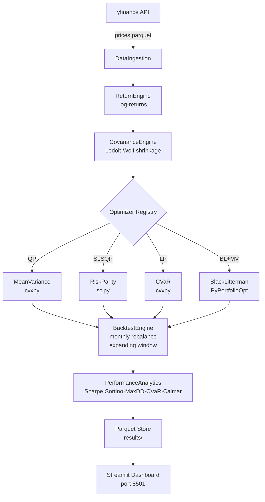

# Architecture

## System Overview



## Design Decisions

### Strategy Pattern — Optimizers
All optimizers implement `BaseOptimizer.optimize(returns, cov_matrix, expected_returns) -> pd.Series`. Adding a 5th method requires only a new file + registration in `run_pipeline.py`.

### Why cvxpy for CVaR (not scipy)?
scipy.minimize can get trapped in local optima for the CVaR LP. The Rockafellar-Uryasev formulation is a true LP — cvxpy's CLARABEL solver guarantees global optimum.

### Why scipy SLSQP for Risk Parity?
The risk-parity objective (minimise pairwise RC differences) is **non-convex**. cvxpy cannot handle it; scipy SLSQP with tight tolerances (ftol=1e-12) reaches a practically optimal solution.

### Ledoit-Wolf vs sample covariance
With T≈1500 days and N=10 assets, the ratio T/N≈150 is reasonable, but Ledoit-Wolf's analytic shrinkage still outperforms sample covariance in out-of-sample tracking — standard practice in production quant systems.

### Parquet over CSV
Parquet preserves dtypes (especially datetime index), is 3–10× smaller, and reads 5–10× faster. Zero schema ambiguity when loading results in the dashboard.

### Black-Litterman views via momentum
Using 6-month trailing momentum makes views data-driven and reproducible — no subjective analyst inputs. This is standard in systematic BL implementations.

## Data Flow

```
prices.parquet       → 1506 rows × 10 tickers (2019-01-01 → 2024-12-31)
returns.parquet      → 1505 rows × 10 tickers (log-returns)
cov_matrix.parquet   → 10×10 annualised Ledoit-Wolf covariance
weights_store.parquet → ~288 rows (4 methods × 72 months)
backtest_results.parquet → ~360 rows (5 methods × 72 months)
performance_summary.parquet → 5 rows (1 per method)
```
